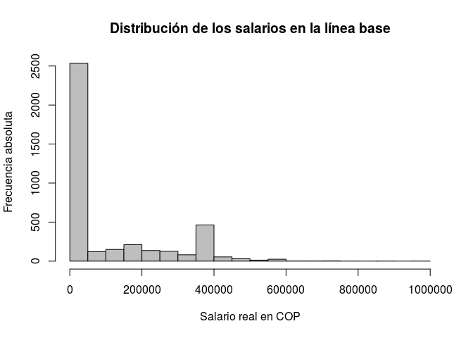

Replicando una RCT (taller Universidad Nacional)
================
Norman Simón Rodríguez
-Mayo 07 de 2018

¿Qué es una RCT?
----------------

La sigla RCT en inglés significa *Randomised Controlled Trial*, que
podemos traducir al español como *Ensayo Controlado Aleatorizado*.

¿En qué consiste la intervención que se evaluó?
-----------------------------------------------

Los investigadores evaluaron una intervención educativa usando un ensayo
controlado aleatorizado. La intervención estaba dirigida a jóvenes en
situación de vulnerabilidad y consistía en un programa de entrenamiento
en capacidades laborales. Su objetivo era mejorar los prospectos
laborales de los jóvenes menos favorecidos. Un resumen de la evaluación
(en inglés) puede encontrarse
[aquí](https://www.povertyactionlab.org/evaluation/vocational-training-disadvantaged-youth-colombia).
El artículo completo está en este
[link](https://www.povertyactionlab.org/sites/default/files/publications/472%20-%20training%20disadvantaged%20youth%20in%20Colombia%20July2011%20AEA.pdf).
A continuación presentamos algunos puntos clave para tener en cuenta:

-   **Población intervenida:** 80 mil hombres y mujeres entre los 18 y
    los 25 años de edad, desempleados, pertenecientes al 20% más pobre
    de la población.

-   **Ubicación geográfica:** Los jóvenes intervenidos habitaban en
    Barranquilla, Bogotá, Bucaramanga, Cali, Cartagena, Manizales o
    Medellín.

-   **Temporalidad:** Entre 2002 y 2006.

-   **Investigadores principales:** Orazio Attanasio, Arlen Guarín,
    Adriana Kugler, Carlos Medina, Costas Meghir.

-   **Instituciones patrocinadoras:** DNP, Econometría S.A., SEI
    Consultores, Economic and Social Research Council, Universidad de
    Houston.

Los datos
---------

Los datos que usaremos en este tutorial se encuentran en este
[link](https://www.aeaweb.org/articles?id=10.1257/app.3.3.188).

El software
-----------

El programa informático que los investigadores utilizaron para hacer el
estudio se llama [STATA](https://www.stata.com/), pero nosotros usaremos
una herramienta diferente, llamada [R](https://www.r-project.org/). En
teoría, los resultados deben ser siempre los mismos aunque se use
software diferente.

Cargando los datos
------------------

Los datos se encuentran en el archivo `datos/AEJApp-20090168_data.dta`,
que es un archivo de Stata. Para leerlo en R vamos a usar el siguiente
comando:

``` r
library(foreign) # Importamos el paquete foreign para poder usar la función read.dta()
datos <- read.dta("datos/AEJApp-20090168_data.dta")
```

Explorando los datos
====================

Podemos mirar algunas estadísticas descriptivas rápidas de los datos con
el comando `summary()`:

``` r
summary(datos)
```

    ##      age_s         dmarried_s        empl_06         salary_06      
    ##  Min.   :19.00   Min.   :0.0000   Min.   :0.0000   Min.   :      0  
    ##  1st Qu.:21.00   1st Qu.:0.0000   1st Qu.:0.0000   1st Qu.:      0  
    ##  Median :23.00   Median :0.0000   Median :1.0000   Median : 250000  
    ##  Mean   :22.72   Mean   :0.2607   Mean   :0.7427   Mean   : 236716  
    ##  3rd Qu.:24.00   3rd Qu.:1.0000   3rd Qu.:1.0000   3rd Qu.: 408000  
    ##  Max.   :46.00   Max.   :1.0000   Max.   :1.0000   Max.   :2000000  
    ##  NA's   :719     NA's   :719      NA's   :719      NA's   :719      
    ##    profit_06         tenure_06          days_06         hours_06     
    ##  Min.   :      0   Min.   :  0.000   Min.   : 0.00   Min.   :  0.00  
    ##  1st Qu.:      0   1st Qu.:  0.000   1st Qu.: 0.00   1st Qu.:  0.00  
    ##  Median :      0   Median :  3.500   Median :24.00   Median : 48.00  
    ##  Mean   :  20225   Mean   :  7.757   Mean   :17.66   Mean   : 38.42  
    ##  3rd Qu.:      0   3rd Qu.: 10.833   3rd Qu.:26.00   3rd Qu.: 56.00  
    ##  Max.   :1000000   Max.   :171.567   Max.   :30.00   Max.   :115.00  
    ##  NA's   :719       NA's   :734       NA's   :719     NA's   :719     
    ##   contract_06       dformal_06         educ_s        lsalary_06    
    ##  Min.   :0.0000   Min.   :0.0000   Min.   : 2.00   Min.   : 4.477  
    ##  1st Qu.:0.0000   1st Qu.:0.0000   1st Qu.:11.00   1st Qu.:12.543  
    ##  Median :0.0000   Median :0.0000   Median :11.00   Median :12.919  
    ##  Mean   :0.2795   Mean   :0.3002   Mean   :10.31   Mean   :12.703  
    ##  3rd Qu.:1.0000   3rd Qu.:1.0000   3rd Qu.:11.00   3rd Qu.:12.919  
    ##  Max.   :1.0000   Max.   :1.0000   Max.   :15.00   Max.   :14.509  
    ##  NA's   :719      NA's   :719      NA's   :735     NA's   :1871    
    ##    lprofit_06       lhours_06        ldays_06           city      
    ##  Min.   : 8.517   Min.   :1.386   Min.   :0.6931   Min.   :1.000  
    ##  1st Qu.:11.472   1st Qu.:3.871   1st Qu.:3.0910   1st Qu.:2.000  
    ##  Median :11.983   Median :3.871   Median :3.2581   Median :3.000  
    ##  Mean   :11.993   Mean   :3.870   Mean   :3.1109   Mean   :3.724  
    ##  3rd Qu.:12.612   3rd Qu.:4.094   3rd Qu.:3.2581   3rd Qu.:5.000  
    ##  Max.   :13.816   Max.   :4.745   Max.   :3.4012   Max.   :7.000  
    ##  NA's   :3661     NA's   :1553    NA's   :1552                    
    ##      age_lb       dmarried_lb        empl_04         salary_04      
    ##  Min.   :18.00   Min.   :0.0000   Min.   :0.0000   Min.   :      0  
    ##  1st Qu.:19.00   1st Qu.:0.0000   1st Qu.:0.0000   1st Qu.:      0  
    ##  Median :21.00   Median :0.0000   Median :1.0000   Median :      0  
    ##  Mean   :21.15   Mean   :0.1933   Mean   :0.5183   Mean   : 102762  
    ##  3rd Qu.:23.00   3rd Qu.:0.0000   3rd Qu.:1.0000   3rd Qu.: 200000  
    ##  Max.   :29.00   Max.   :1.0000   Max.   :1.0000   Max.   :1000000  
    ##                                                                     
    ##    profit_04        tenure_04          days_04         hours_04     
    ##  Min.   :     0   Min.   :  0.000   Min.   : 0.00   Min.   :  0.00  
    ##  1st Qu.:     0   1st Qu.:  0.000   1st Qu.: 0.00   1st Qu.:  0.00  
    ##  Median :     0   Median :  0.000   Median : 8.00   Median : 14.00  
    ##  Mean   : 22856   Mean   :  3.633   Mean   :12.41   Mean   : 25.86  
    ##  3rd Qu.:     0   3rd Qu.:  4.033   3rd Qu.:26.00   3rd Qu.: 48.00  
    ##  Max.   :900000   Max.   :171.167   Max.   :30.00   Max.   :119.00  
    ##                   NA's   :285                                       
    ##   contract_04        dformal_04         educ_lb         ldays_04     
    ##  Min.   :0.00000   Min.   :0.00000   Min.   : 0.00   Min.   :0.6931  
    ##  1st Qu.:0.00000   1st Qu.:0.00000   1st Qu.:10.00   1st Qu.:3.0910  
    ##  Median :0.00000   Median :0.00000   Median :11.00   Median :3.2581  
    ##  Mean   :0.08415   Mean   :0.09098   Mean   :10.09   Mean   :3.1232  
    ##  3rd Qu.:0.00000   3rd Qu.:0.00000   3rd Qu.:11.00   3rd Qu.:3.3322  
    ##  Max.   :1.00000   Max.   :1.00000   Max.   :16.00   Max.   :3.4012  
    ##                                      NA's   :8       NA's   :1906    
    ##    lhours_04          select        pempl_06         pempl_04     
    ##  Min.   :0.000   control :1916   Min.   :0.0000   Min.   :0.0000  
    ##  1st Qu.:3.689   selected:2041   1st Qu.:0.0000   1st Qu.:0.0000  
    ##  Median :3.871                   Median :1.0000   Median :0.0000  
    ##  Mean   :3.810                   Mean   :0.6442   Mean   :0.3675  
    ##  3rd Qu.:4.094                   3rd Qu.:1.0000   3rd Qu.:1.0000  
    ##  Max.   :4.779                   Max.   :1.0000   Max.   :1.0000  
    ##  NA's   :1912                    NA's   :719                      
    ##    dcontinue       codigo_ecap      codigo_curs           dwomen      
    ##  Min.   :0.0000   Min.   :  1.00   Min.   :13110005   Min.   :0.0000  
    ##  1st Qu.:1.0000   1st Qu.: 36.00   1st Qu.:13530005   1st Qu.:0.0000  
    ##  Median :1.0000   Median : 56.00   Median :63220025   Median :1.0000  
    ##  Mean   :0.8183   Mean   : 60.54   Mean   :49155510   Mean   :0.5393  
    ##  3rd Qu.:1.0000   3rd Qu.: 89.00   3rd Qu.:73322556   3rd Qu.:1.0000  
    ##  Max.   :1.0000   Max.   :114.00   Max.   :96170105   Max.   :1.0000  
    ##                   NA's   :1        NA's   :1                          
    ##    p_selecap     
    ##  Min.   :0.0000  
    ##  1st Qu.:0.6667  
    ##  Median :0.7353  
    ##  Mean   :0.6760  
    ##  3rd Qu.:0.7534  
    ##  Max.   :0.8646  
    ##  NA's   :719

Si, por ejemplo, quisiéramos saber cuál es la proporción de mujeres en
la muestra de estudio, podríamos simplemente hallar el promedio
aritmético de la variable `dwomen`, que es una variable dummy:

``` r
mean(datos$dwomen)
```

    ## [1] 0.5392974

Si además estamos interesados en saber cuántos hombres y cuántas mujeres
hay (no sólo el porcentaje de mujeres), podemos hacer una tabla de
frecuencias absolutas con la función `table()` (recordando que un valor
de `1` corresponde a mujer y uno de `0` a hombre):

``` r
table(datos$dwomen)
```

    ## 
    ##    0    1 
    ## 1823 2134

Podemos también crear un histograma para mirar la distribución de
salarios en la línea de base (la variable `salary_04`), es decir, en el
“pre”:

``` r
options(scipen=5) # Comente esta línea para ver qué pasa con el gráfico.
hist(datos$salary_04
     , main="Distribución de los salarios en la línea base"
     , xlab="Salario real en COP"
     , ylab="Frecuencia absoluta"
     , breaks=15
     , col="gray")
```



Podemos hacer este mismo histograma, pero para los salarios *después de
haber desarrollado la intervención* (en el “post”). La variable de
interés es `salary_06`.

``` r
options(scipen=5) # Comente esta línea para ver qué pasa con el gráfico.
hist(datos$salary_06
     , main="Distribución de los salarios en la línea final"
     , xlab="Salario real en COP"
     , ylab="Frecuencia absoluta"
     , breaks=15
     , col="gray")
```


A juzgar por este diagrama, la distribución de salarios post-tratamiento
es:

-   Unimodal.
-   Bimodal.

¿Qué podría estar causando esto?
